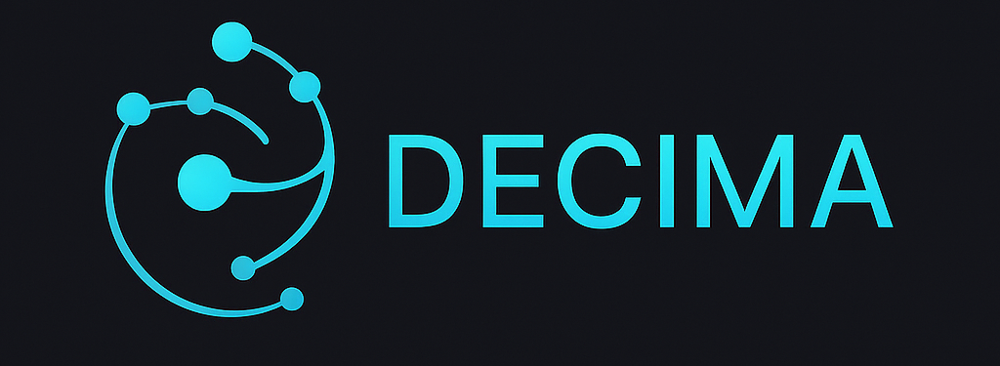

<p align="center">
  
</p>

# DECIMA
**Data Extraction & Contextual Inference for MCNP Analysis**

> Powered by LLMs, Knowledge Graphs, and MCNPTools  
> Simple. Portable. Ready-to-run via Docker.

---
## 📦 Features

- Modular architecture inspired by *Metal Gear Solid* agents:
  - **QUIET**: Query Interpreter for natural language analysis  
  - **EMMA**: Knowledge Graph manager (Neo4j backend)  
  - **OTACON**: Central LLM agent for PTRAC reasoning and code generation  
  - **EVA**: Safe sandbox for executing generated Python code  
  - **CAMPBELL**: Orchestrator coordinating all modules  

- Full support for MCNP `PTRAC` files via `mcnptools`  
- Knowledge Graph context injection (Neo4j)  
- Verbose debug mode with detailed workflow + LLM context inspection  
- Web interface (Flask + Bootstrap)  

---

## 🔑 API Key Requirement

To run LLM-based queries, you must provide a valid **OpenAI API key**.  
Currently supported models are:  
- **gpt-4o-mini** (default)  
- **gpt-4o**  

From my own experience, **gpt-4o-mini** is very cost-effective — around **10 queries for 1 cent**.  

👉 For testing purposes, I can provide a **temporary free API key** (limited in time and usage).  
If you are interested, please contact me directly via [LinkedIn](#-contact).

---

---

## 🔧 Demo Mode (for testing without API key)

DECIMA includes a **demo mode** for reviewers and first-time users.

- If no API key is provided, or if `DEMO_MODE=true` is set in your `.env.docker` file,  
  DECIMA runs in a fallback mode.

- In this mode, the system always returns a **fixed example**: positions (x,y,z) and energies  
  of collision events from the uploaded PTRAC file.  
  This ensures that DECIMA remains executable even without access to external LLM APIs.

⚠️ Demo mode is **limited**: it ignores your actual query and does not call the LLM.

To unlock the full functionality, set your `OPENAI_API_KEY` in `.env.docker`  
and set `DEMO_MODE=false`.

⚠️ Important:
- If `OPENAI_API_KEY` is **valid** → DECIMA runs in full mode.
- If `OPENAI_API_KEY` is **empty** → DECIMA runs in Demo Mode (fallback).
- If `OPENAI_API_KEY` is **set but invalid** → DECIMA will raise an error 
  (`[ERROR:INVALID_API_KEY]`) and **will not fallback** to Demo Mode.

---


## 📦 Installation (via Docker)

### ✅ Prerequisites

Make sure you have installed **Docker**:  
👉 [https://docs.docker.com/get-docker/](https://docs.docker.com/get-docker/)

> 🐧 **Linux Users:**  
> You might need to run Docker commands with `sudo` unless you’ve added your user to the Docker group.  
> See: [Manage Docker as a non-root user](https://docs.docker.com/engine/install/linux-postinstall/)

---

### 🚀 Setup Steps

```bash
# 1. Clone the repository
git clone https://github.com/quentinducasse/decima.git
cd decima
```

---

### 🛠️ 2. Configure your environment

Copy the Docker env template and fill in your API key:

```bash
cp .env.docker.example .env.docker
```

Edit `.env.docker` with:

```env
LLM_PROVIDER=openai
OPENAI_API_KEY=sk-...   # ← Insert your API key

NEO4J_URI=bolt://neo4j:7687
NEO4J_USER=neo4j
NEO4J_PASSWORD=decima123
```

> ⚠️ Do **not** use `localhost` for `NEO4J_URI` — use the internal Docker service name (`neo4j`).

---

### 🐳 3. Build and launch DECIMA

```bash
docker compose build app   # Only needed the first time, or if Dockerfile/requirements.txt change
docker compose up -d
```

This will automatically:
- Start a Neo4j container (ports 7474 + 7687)
- Start the DECIMA web server (port 5050)
- Mount your local source code into the container (`.:/app`) → any local code change is immediately visible

Load the Knowledge Graph:

```bash
docker compose exec app python kg/loader/neo4j_loader.py
```

---

### 🌐 Access the Interfaces

- Web App (DECIMA): [http://localhost:5050](http://localhost:5050)
- Neo4j Browser: [http://localhost:7474](http://localhost:7474)

> Log in with:  
> **Username:** `neo4j`  
> **Password:** `decima123`

---

## ▶️ After Installation: How to Use

### ▶️ Daily usage

### 1. Launch DECIMA in **normal mode** 

```bash
# Start the stack (Neo4j + DECIMA app)
docker compose up -d

# Load or reload the Knowledge Graph
# (this step must be repeated after each Neo4j rebuild or restart)
docker compose exec app python kg/loader/neo4j_loader.py

# Stop all services
docker compose down
```

> Use `sudo` in front of the commands above if you get a permission error on Linux.

Then open your browser and go to: [http://localhost:5050](http://localhost:5050)

---

### 1 alternative. Launch DECIMA in **debug/verbose mode** 
 

```bash
# Start Neo4j only (in background)
docker compose up -d neo4j

# Load or reload the Knowledge Graph (inside the app container)
docker compose run --rm app python kg/loader/neo4j_loader.py

# Run the app with detailed logs
docker compose run --rm --service-ports app python app.py -v
```

- neo4j must be up before running the app  
- `--service-ports` ensures port `5050` is exposed  
- `-v` enables **verbose mode** (full logs, debug info, context sent to the LLM)  

➡️ Access the app at [http://localhost:5050](http://localhost:5050)  
---

## ✨ Example Usage

1. Upload your `.ptrac` file. DECIMA currently supports **binary** and **ASCII** formats.  
   *(Future releases will also support **HDF5 format**, commonly used for parallelized MCNP calculations.)*

2. Ask a natural language question like:

```text
Print x y z positions and energies of neutrons entering surface 401 for the 20 first histories
```

3. DECIMA will:
   - Analyze the query
   - Use the KG for context
   - Generate and run code
   - Return structured results

---

## 📁 Project Structure

```
├── app.py
├── docker-compose.yml
├── Dockerfile
├── modules/        # QUIET, OTACON, EMMA, EVA...
├── kg/             # Knowledge Graph (triplets, loader)
├── frontend/       # Web interface (HTML/JS)
├── uploads/        # PTRAC files + plots
├── tools/          # Sandboxed code execution
├── mcnptools/      # Local copy of MCNPTools
├── data/           # Sample files
├── .env.docker.example
└── requirements.txt
```

---

## 📖 Documentation

See the [`doc/`](doc/) folder for:

- `DECIMA Project Technical Documentation.md`
- `DECIMA Project User Documentation.md`

---

## 📚 Citation

> Almuhisen F. and Ducasse Q., *DECIMA – An LLM-based assistant for MCNP particle tracking analysis*, v1.1.1, GitHub, 2025.  
> [https://github.com/quentinducasse/decima](https://github.com/quentinducasse/decima)
> Cite the JOSS paper (DOI) once published for academic use.
---

## 📜 License

DECIMA is distributed under the **Apache License 2.0 (OSI-approved, open source)**.  
See the [LICENSE](LICENSE) file for details.

📌 If you use DECIMA in academic work, please cite the upcoming JOSS paper (DOI pending).

DECIMA relies on third-party libraries distributed under permissive OSI-approved licenses (MIT, BSD, Apache, EPL). See NOTICE for details.
---

Author: Feda Almuhisen & Quentin Ducasse  
Project: DECIMA — Data Extraction & Contextual Inference for MCNP Analysis  
Year: 2025  

For commercial licensing inquiries (e.g., integration into a product, for-profit application), please contact the authors to discuss custom licensing terms.

---

## 🤝 Acknowledgments

- [MCNPTools (LANL)](https://github.com/lanl/mcnptools)
- [OpenAI](https://openai.com/) & [ASI:One](https://asi.one/)
- [Neo4j](https://neo4j.com/)

---

## 🚧 Roadmap

- [ ] MCTAL (FORTUNE) support  
- [ ] Batch file processing  
- [ ] Public access (key-restricted)  
- [ ] MCNP6+ compatibility  
- [ ] Extended features for much more precise answers

---

## 📬 Contact

For questions, collaborations, or temporary API key requests, feel free to reach out on **LinkedIn**:  
👉 [Quentin Ducasse](https://www.linkedin.com/in/quentin-ducasse-a65410124/)  
👉 [Feda Almuhisen](https://www.linkedin.com/in/feda-almuhisen/)  