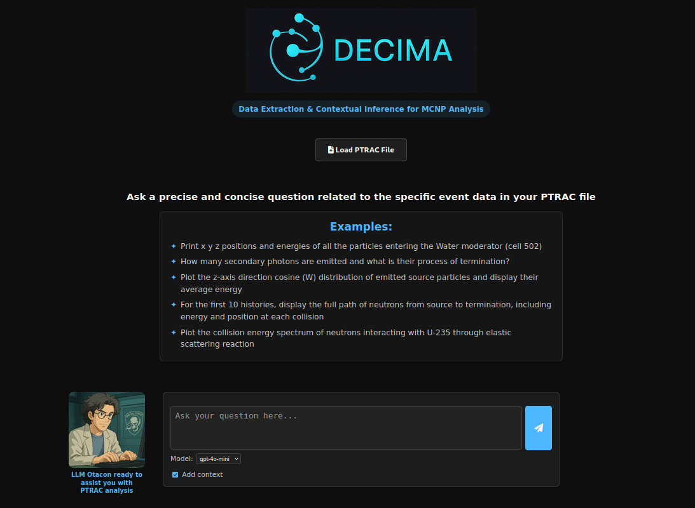

# DECIMA
**Data Extraction & Contextual Inference for MCNP Analysis**
> DECIMA is the first open-source framework combining LLMs and Knowledge Graphs for analyzing MCNP Particle Track Output (PTRAC) files
> AI-powered MCNP data analysis through natural language queries  
> Built with LLMs, Knowledge Graphs, and MCNPTools  
> Production-ready via Docker deployment

## 🎯 What is DECIMA?

DECIMA transforms how nuclear engineers and researchers interact with MCNP simulation data. Instead of writing complex analysis scripts, simply ask questions in natural language:

**"Display collision positions and energies deposited for the first 20 particle histories"**  
**"Plot the z-axis direction cosine (W) distribution of emitted source particles"**  
**"How many secondary photons are emitted and what is their process of termination?"**

### ✨ See DECIMA in Action

<p align="center">
  
</p>

*Ask questions in natural language - DECIMA's AI assistant OTACON will generate and execute the analysis code for you. The interface shows example queries, model selection, and the friendly OTACON character ready to assist with your PTRAC analysis.*

### Key Benefits
- 🗣️ **Natural Language Queries** - No more complex scripting for data extraction
- 🧠 **AI-Powered Analysis** - Leverages advanced LLMs for intelligent interpretation  
- 📊 **Automated Visualization** - Generates plots and print results automatically
- 🔗 **Knowledge Integration** - Uses domain-specific context for accurate results

---
## 🗏️ Architecture

DECIMA uses a modular architecture inspired by *Metal Gear Solid* agents:

- **🤫 QUIET**: Natural language query interpreter
- **🧠 EMMA**: Knowledge graph manager (Neo4j backend) 
- **👨‍💻 OTACON**: Central LLM agent for reasoning and code generation
- **⚡ EVA**: Secure sandbox for Python code execution
- **📡 CAMPBELL**: System orchestrator coordinating all modules 

## 🛠️ Features
- Full support for MCNP `PTRAC` files via `mcnptools`  
- Knowledge Graph context injection (Neo4j)  
- Verbose debug mode with detailed workflow + LLM context inspection  
- Web interface (Flask + Bootstrap)  

---

## 🔑 API Key Requirement

To run LLM-based queries, you must provide a valid **OpenAI API key**
Currently supported models are:  
- **gpt-4o-mini** (default)  
- **gpt-4o**

**Get an API key:** [OpenAI Platform](https://platform.openai.com/api-keys)
  
From my own experience, **gpt-4o-mini** is very cost-effective — around **10 queries for 1 cent**

---

## 🔧 Demo Mode (for testing without API key)

DECIMA includes a **demo mode** for reviewers and first-time users.

- If no API key is provided, or if `DEMO_MODE=true` is set in your `.env.docker` file,  
  DECIMA runs in a fallback mode.

- In this mode, the system always returns a **fixed example**: positions (x,y,z) and energies  
  of collision events from the uploaded PTRAC file.  
  This ensures that DECIMA remains executable even without access to external LLM APIs.

⚠️ Demo mode is **limited**: it ignores your actual query and does not call the LLM.

To unlock the full functionality, set your `OPENAI_API_KEY` in `.env.docker`  
and set `DEMO_MODE=false`.

⚠️ Important:
- If `OPENAI_API_KEY` is **valid** → DECIMA runs in full mode.
- If `OPENAI_API_KEY` is **empty** → DECIMA runs in Demo Mode (fallback).
- If `OPENAI_API_KEY` is **set but invalid** → DECIMA will raise an error 
  (`[ERROR:INVALID_API_KEY]`) and **will not fallback** to Demo Mode.

---

## ▶️ Example Usage

1. A sample PTRAC file is already provided in the repository for quick testing: 
This file is in **ASCII format** and can be used immediately to validate your installation.
The sample PTRAC file is located under the `data/ptrac_samples/` directory of your DECIMA installation:
`<DECIMA_INSTALL_DIR>/data/ptrac_samples/basic_ptrac_example_decima_ascii.ptrac`

2. Upload it or your own `.ptrac` file if desired. DECIMA currently supports **binary** and **ASCII** formats.  
*(Future releases will also support **HDF5 format**, commonly used for parallelized MCNP calculations.)*

3. Ask a natural language question like:

```text
Print x y z positions and energies of all events for the 20 first histories
```

4. DECIMA will:
   - **Analyze the query** using QUIET (language detection, keyword extraction)
   - **Enrich with context** using EMMA (Knowledge Graph entities)
   - **Generate explanation + code** using OTACON (LLM reasoning)
   - **Execute securely** using EVA (sandboxed Python execution)
   - **Return structured results** with stdout, plots, and any errors

### 🔄 Complete Workflow Example

**Your Question:** *"What are the collision energies for neutrons in the first 5 histories?"*

**DECIMA's Response:**
- **Explanation:** Clear description of what the analysis will do
- **Generated Code:** Python script using `mcnptools` library
- **Execution Results:** 
  - Data output (positions, energies, .etc)
  - Visualizations 

---

## 📁 Project Structure

```
├── app.py
├── docker-compose.yml
├── Dockerfile
├── modules/        # QUIET, OTACON, EMMA, EVA...
├── kg/             # Knowledge Graph (triplets, loader)
├── frontend/       # Web interface (HTML/JS)
├── uploads/        # PTRAC files + plots
├── tools/          # Sandboxed code execution
├── mcnptools/      # Local copy of MCNPTools
├── data/           # Sample files
├── .env.docker.example
└── requirements.txt
```

---

## 📖 Documentation

See the [`doc/`](doc/) folder for:

- `DECIMA Project Technical Documentation.md`
- `DECIMA Project User Documentation.md`

---

## 📚 Citation

If you use DECIMA in your work, please cite the software as follows:

> Almuhisen F. and Ducasse Q., *DECIMA — Data Extraction & Contextual Inference for MCNP Analysis*,  
> Version v1.2.0, GitHub repository, 2025.  
> Available at: [https://github.com/quentinducasse/decima](https://github.com/quentinducasse/decima)

📌 A JOSS paper submission is in preparation. Once published, please update your citation to use the official DOI.

---

## 📜 License

DECIMA is distributed under the **Apache License 2.0 (OSI-approved, open source)**.  
See the [LICENSE](LICENSE) file for details.

📌 If you use DECIMA in academic work, please cite the upcoming JOSS paper (DOI pending).

DECIMA relies on third-party libraries distributed under permissive OSI-approved licenses (MIT, BSD, Apache, EPL). See NOTICE for details.

---

Author: Feda Almuhisen & Quentin Ducasse  
Project: DECIMA — Data Extraction & Contextual Inference for MCNP Analysis  
Year: 2025  

For commercial licensing inquiries (e.g., integration into a product, for-profit application), please contact the authors to discuss custom licensing terms.

---

## 🤝 Acknowledgments

- [MCNPTools (LANL)](https://github.com/lanl/mcnptools)
- [OpenAI](https://openai.com/)
- [Neo4j](https://neo4j.com/)

---

## 🚧 Roadmap

- [ ] **MCTAL analysis and plotting module**  
  Extend parsing to MCNP tally outputs with visualization.  

- [ ] **Batch processing**  
  Enable multiple PTRAC/MCTAL files to be analyzed in a single session for comparative studies.  

- [ ] **MCNP6+ compatibility**  
  Ensure robust parsing of outputs generated by the latest MCNP versions and HDF5 compatibility.  

- [ ] **Advanced reasoning features**  
  Integrate improved context handling, entity disambiguation, and domain-specific inference.  

- [ ] **… and extended features for much more precise answers 😉**  

---

## 📬 Contact

For questions, collaborations, or temporary API key requests, feel free to reach out on **LinkedIn**:  
👉 [Quentin Ducasse](https://www.linkedin.com/in/quentin-ducasse-a65410124/)  
👉 [Feda Almuhisen](https://www.linkedin.com/in/feda-almuhisen/)  
