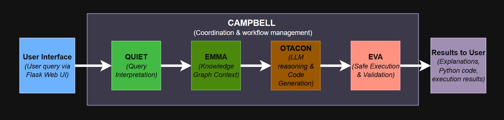
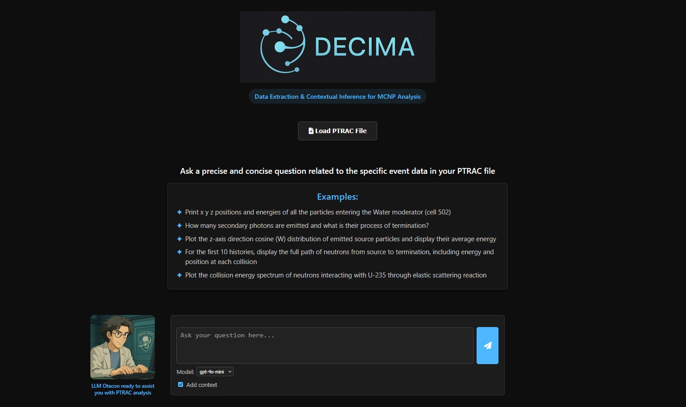
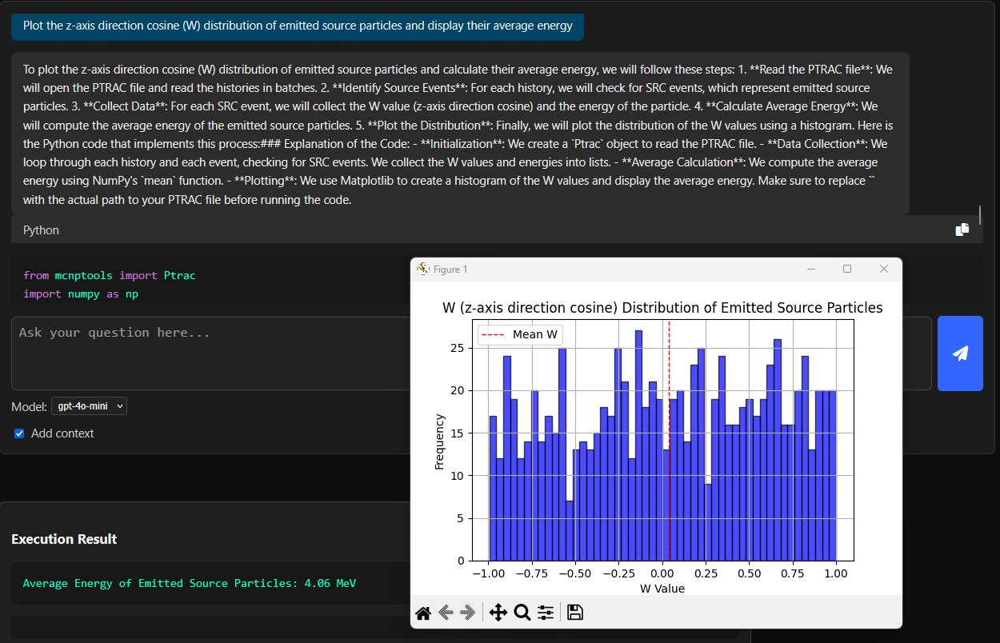

# Summary

DECIMA (**Data Extraction & Contextual Inference for MCNP Analysis**) is an open-source framework
for the analysis of Monte Carlo N-Particle (MCNP) outputs. It integrates **MCNPTools** for access to
binary and ASCII `PTRAC` files, a **Neo4j knowledge graph** for contextual reasoning, and **Large Language Models (LLMs)**
to enable natural language querying in English or French.  
DECIMA automatically translates user queries into executable Python code, runs them securely in a sandbox, and returns
structured results with explanations. A modular architecture ensures transparency, extensibility, and safe execution.  
The project is distributed under the **Apache License 2.0** (OSI-approved open source).

# Statement of need

MCNP is a widely used Monte Carlo transport code in nuclear engineering and physics. Its outputs, such as PTRAC (particle track histories) and MCTAL (tallies: scoring data that record physical quantities such as flux or dose), contain rich information on particle transport and interactions. However, parsing and analyzing these files requires significant programming expertise and domain-specific knowledge, which can limit accessibility for non-specialists and slow down research workflows.

Over the years, several tools have been developed to facilitate MCNP output analysis. MCNPTools [@mcnptools2022] provides a reference C++/Python library for parsing MCTAL and PTRAC files, while Easy-PTRAC [@easyptrac2018] offers a graphical interface for filtering histories. Community-driven projects such as PyNE [@pyne2019], SANDY [@sandy2021], F4Enix [@f4enix2021], mc-tools [@mctools2020], and MCNPy [@mcnpy2022] extend these capabilities by focusing on specific formats or workflows. While these solutions are valuable, they remain fragmented. DECIMA differs by unifying parsing, reasoning, and execution in a single coherent framework, accessible through natural language queries.

DECIMA addresses these challenges by providing an integrated assistant that bridges natural language interaction, knowledge graph reasoning, and automated code execution. Instead of manually combining tools and scripts, users can query DECIMA in plain English or French. The system interprets the query, enriches it with structured knowledge, generates validated Python code, and executes it securely. In this way, DECIMA lowers the entry barrier for students, engineers, and researchers, enabling reproducible, auditable, and accessible analysis of MCNP outputs.

# Software description

DECIMA follows a modular and agent-based design, where each component contributes a specific role within a continuous workflow.  
A user query is first submitted through a lightweight **Flask-based web interface**, which provides the entry point for uploading PTRAC files and entering natural language questions.  

The query is then processed by **QUIET** (QUery Interpreter for Entity Targeting), which detects the query language, extracts keywords, and identifies relevant entities such as events, particles, or data fields.  
It is subsequently enriched by **EMMA** (Engine for Metadata Mapping & Analysis), which connects to a Neo4j-based Knowledge Graph constructed directly from the MCNPTools code base.  
This graph is populated with triplets describing classes, methods, enumerations, and dictionaries, enabling precise entity retrieval via Cypher queries [@Cypher2018].  
Together with this graph, the system also provides the LLM with an explicit code structure, a typical example of usage, and a set of strict coding rules, ensuring that the generated answers remain aligned with the MCNPTools API and best practices.  

The enriched input is then passed to **OTACON** (Operator for Assisted Communication & Output Navigation), the reasoning engine.  
Using a Large Language Model (LLM), it combines the contextual knowledge from EMMA with static MCNPTools information to generate both a clear natural language explanation and executable Python code.  
By default, DECIMA relies on GPT-4o-mini for cost-effective operation, while GPT-4o can be selected for more demanding analyses.  

The resulting code is executed by **EVA** (Execution & Validation Agent), which runs it inside a secure sandbox.  
During execution, placeholders are replaced by the actual PTRAC file path, and the system captures all outputs, error logs, and plots.  
Results can appear directly as textual `print` statements or as visualizations (plots), which are automatically generated and stored.  

The entire process is coordinated by **CAMPBELL** (Coordination & Assignment Manager for Process Balancing & Execution Logistics Layer), implemented with LangGraph to manage state transitions and ensure that results flow smoothly back to the user interface.  

An optional **add context** mode allows benchmarking of LLM outputs with and without contextual enrichment.  
This comparison highlights a critical finding: without context injection, current LLMs consistently fail to produce directly executable code using the `mcnptools` library.  
DECIMA’s integration of structured knowledge is therefore essential for achieving reliable and reproducible analyses.  

The overall workflow is illustrated in Figure 1: a user query is interpreted by QUIET, enriched with semantic knowledge via EMMA, transformed into explanations and executable code by OTACON, executed safely in EVA, and finally returned to the user interface under CAMPBELL’s orchestration.  

  
*Figure 1: End-to-end workflow of DECIMA. User queries are interpreted, enriched with contextual knowledge, transformed into executable code, validated in a secure sandbox, and returned as structured results.*  

# Example usage

To illustrate DECIMA’s capabilities, we consider a minimal yet representative MCNP problem.  
The setup consists of three concentric spherical shells surrounding a central neutron source:

- **Cell 501**: Highly Enriched Uranium (HEU), radius ≤ 5 cm (surface 401)  
- **Cell 502**: Water moderator, 5–6 cm (surfaces 401–402)  
- **Cell 503**: Air, 6–7 cm (surfaces 402–403)  
- **Cell 999**: External void (outside surface 403)  

The source is placed at the center (0,0,0) within the HEU fuel (cell 501).  
It follows the spontaneous fission spectrum of Cf-252 with an anisotropic angular distribution.  
About 1000 particle histories are tracked in the PTRAC output.

  
*Figure 2: Simplified geometry used for the demonstration case, consisting of three concentric spherical shells (HEU, water, air) surrounding a central Cf-252 neutron source.*

---

### Step 1: Installing and launching DECIMA
DECIMA (OTACON agent) returns an explanation of the analysis process together with executable Python code.  
It should be noted that the exact code generated may vary across runs, since it is produced by a Large Language Model (LLM).  
The output can also depend on the selected backend model (e.g., GPT-4o vs GPT-4o-mini), but in most cases DECIMA ensures that the code is syntactically valid and executable within the sandbox.

To install and launch DECIMA with Docker (please look at the `README.md` for detailed instructions):

```bash
git clone https://github.com/quentinducasse/decima.git
cd decima
cp .env.docker.example .env.docker
docker compose build app
docker compose up -d
docker compose exec app python kg/loader/neo4j_loader.py
```

The user opens the web interface at [http://localhost:5050](http://localhost:5050) and uploads the PTRAC file.  


*Figure 3: Web-based interface of DECIMA, where users can upload PTRAC files, enter natural language queries, and inspect results.*

---

### Step 2: Querying in natural language
The following query is entered into DECIMA:

> *“Plot the z-axis direction cosine (W) distribution of emitted source particles and display their average energy.”*

---

### Step 3: LLM response and generated code
DECIMA (OTACON agent) returns an explanation of the analysis process together with executable Python code:

```python
from mcnptools import Ptrac
import matplotlib.pyplot as plt

ptrac_path = '<PTRAC_PATH_PLACEHOLDER>'
p = Ptrac(ptrac_path, Ptrac.BIN_PTRAC)

w_values = []
energies = []

# Read histories in batches of 10000
hists = p.ReadHistories(10000)
while hists:
    for h in hists:
        for e in range(h.GetNumEvents()):
            event = h.GetEvent(e)
            if event.Type() == Ptrac.SRC:
                if event.Has(Ptrac.W):
                    w_values.append(event.Get(Ptrac.W))
                if event.Has(Ptrac.ENERGY):
                    energies.append(event.Get(Ptrac.ENERGY))
    hists = p.ReadHistories(10000)

# Calculate average energy
average_energy = sum(energies) / len(energies) if energies else 0

# Plotting the W distribution
plt.hist(w_values, bins=50, alpha=0.7, color='blue', edgecolor='black')
plt.title('W Distribution of Emitted Source Particles')
plt.xlabel('W (z-axis direction cosine)')
plt.ylabel('Frequency')
plt.grid(True)
plt.show()

print(f'Average Energy of Emitted Source Particles: {average_energy:.2f} MeV')
```

---

### Step 4: Results
The code recognize the format type of the PTRAC file and executes it successfully within DECIMA’s sandbox (EVA agent).  
The result includes a histogram of the z-axis direction cosines for emitted source particles,  
together with the computed average energy.


*Figure 4: Example output produced by DECIMA: histogram of the z-axis direction cosine (W) for emitted source particles, with average energy automatically calculated.*

For this case, DECIMA reports:

```
Average Energy of Emitted Source Particles: 4.06 MeV
```

This example demonstrates how DECIMA allows users to query PTRAC files in natural language, automatically generating code, executing the analysis, and returning interpretable results in a reproducible manner.

# Related work

Several tools support MCNP output processing:

- **MCNPTools** (LANL) [@mcnptools2022]: reference C++/Python library for parsing MCTAL, MESHTAL, PTRAC.  
- **Easy-PTRAC** (ASNR) [@easyptrac2018]: GUI for filtering particle histories and exporting results.  
- **mc-tools** (community, GitHub) [@mctools2020]: Python converters (mctal2root, mctal2txt).  
- **F4Enix** (Fusion for Energy) [@f4enix2021]: modular Python package for MCNP input/output workflows.  
- **SANDY** [@sandy2021]: parses MCTAL tallies into pandas DataFrames.  
- **PyNE** [@pyne2019]: includes MCNP mesh tally parsers and a PtracReader.  
- **MCNPy** [@mcnpy2022]: Python API for MCNP input deck manipulation.  

DECIMA builds on these but is unique in combining **Knowledge Graph reasoning** and **LLM-based interaction**, enabling
human-like queries, automatic code generation, and safe execution.

# Acknowledgements
This work was carried out independently of institutional projects at ASNR and CEA.
We thank the MCNPTools developers at LANL, the ASNR LMDN group for providing access to Easy-PTRAC.  
This project also acknowledges Neo4j, OpenAI.

# References
