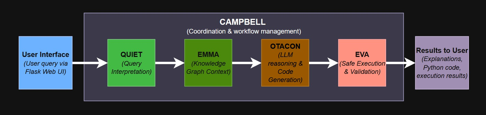
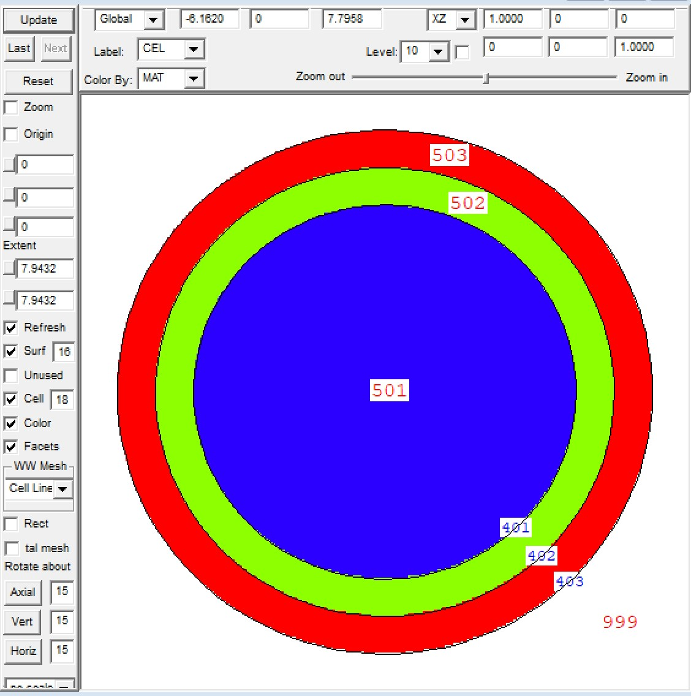
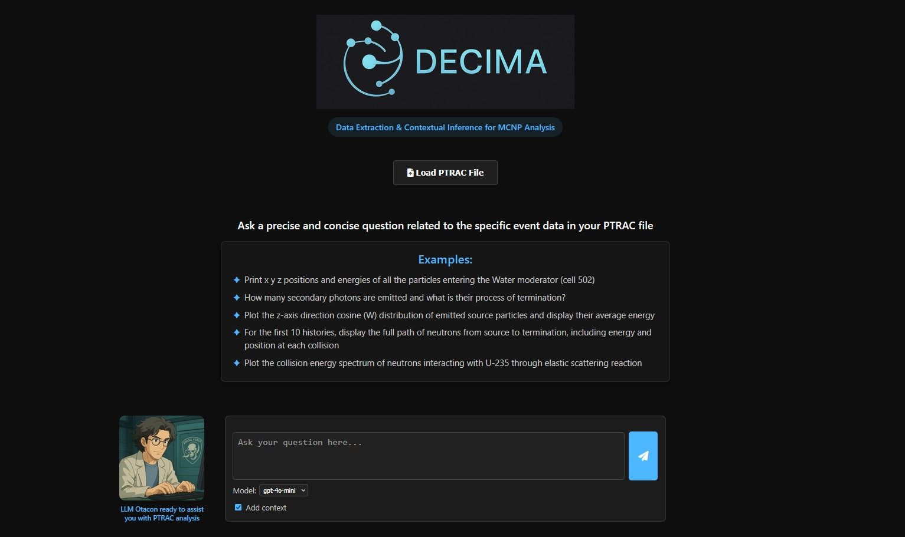
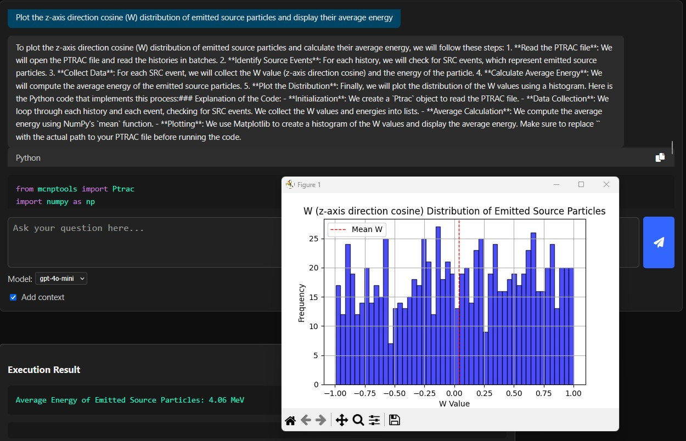

# Summary

DECIMA (Data Extraction & Contextual Inference for MCNP Analysis) is an open-source Python framework designed to make analyzing Monte Carlo N-Particle (MCNP) outputs more accessible to researchers and engineers. The tool integrates MCNPTools for parsing PTRAC files, a Neo4j knowledge graph containing MCNP domain knowledge extracted from the MCNPTools codebase, and Large Language Models (LLMs), allowing users to query their simulation results in natural language (English or French).

At its core, DECIMA provides a Python API through the `CampbellOrchestrator` class that can be integrated into scripts, Jupyter notebooks, or automated analysis pipelines. Users describe their analysis goals in natural language, and DECIMA translates these requests into executable Python code using the `mcnptools` library, executes the code in a secure sandbox environment, and returns both results and natural language explanations. The modular architecture ensures that each component remains transparent and extensible. The project is distributed under the Apache License 2.0.

# Statement of need

MCNP is widely used in nuclear engineering and physics for simulating particle transport phenomena. Its output files—particularly PTRAC (particle track histories) and MCTAL (tallies recording flux, dose, and other physical quantities)—contain rich information about particle interactions and system behavior. However, extracting meaningful insights from these files typically requires both programming expertise and deep understanding of the MCNPTools API, presenting a significant barrier for students, new users, or researchers who need quick answers without developing custom parsing scripts.

The nuclear engineering community has developed various tools to address these challenges. MCNPTools [@mcnptools2022] provides the reference implementation for parsing MCTAL and PTRAC files in C++ and Python. Easy-PTRAC [@easyptrac2018] offers a graphical interface for filtering particle histories. Projects such as PyNE [@pyne2019], SANDY [@sandy2021], F4Enix [@f4enix2021], mc-tools [@mctools2020], and MCNPy [@mcnpy2022] extend these capabilities for specific workflows or file formats. While these tools are valuable, the ecosystem remains somewhat fragmented—users often need to combine multiple packages and develop custom integration code to answer specific analysis questions.

DECIMA takes a different approach by integrating natural language interaction, knowledge graph reasoning, and automated code execution within a single framework. Instead of manually chaining tools or writing analysis scripts, users can ask DECIMA questions like "What's the average energy of neutrons reaching the detector?" The system interprets the query, retrieves relevant MCNP concepts from its knowledge graph, generates Python code using the `mcnptools` library, and executes it in a secure environment. This approach aims to lower the technical barrier for newcomers while maintaining transparency and auditability that experienced users require—all generated code is visible and modifiable.

# Software description

## Python Package Architecture

DECIMA is distributed as a standard Python package with a straightforward API for programmatic use. The main entry point is the `CampbellOrchestrator` class, which coordinates all internal components:

```python
from modules.campbell import CampbellOrchestrator

# Initialize the orchestrator
orchestrator = CampbellOrchestrator()

# Process a query on a PTRAC file
result = orchestrator.process_query(
    query='Show collision energies for the first 10 histories',
    ptrac_path='path/to/file.ptrac',
    use_context=True  # Enable Knowledge Graph context
)

# Access results
print(result['response'])          # Natural language explanation
print(result['code'])              # Generated Python code
print(result['execution_result'])  # Execution output and plots
print(result['logs'])              # Workflow logs
```

The package currently requires Docker for running Neo4j (Knowledge Graph storage), while mcnptools is compiled locally during installation (as it is not yet available on PyPI). The Knowledge Graph must be loaded once using the provided loader script, after which it persists in the Neo4j database for subsequent queries.

## Modular Components

DECIMA employs a modular design where each component handles a specific part of the analysis workflow.

The process begins with **QUIET** (QUery Interpreter for Entity Targeting), which performs language detection (English or French), keyword extraction, and entity identification. It recognizes MCNP-specific entities such as event types (source: `SRC`, collision: `COL`, termination: `TER`), particle types, data fields (`ENERGY`, `W`), and MCNPTools classes or methods.

**EMMA** (Engine for Metadata Mapping & Analysis) enriches the query using a Neo4j knowledge graph constructed from the MCNPTools codebase through automated static code analysis. This graph contains structured information about classes (`Ptrac`, `History`, `Event`), methods (`ReadHistories`, `GetEvent`), enumerations, and internal data structures. EMMA retrieves relevant entities using Cypher queries [@Cypher2018]. In addition to graph entities, DECIMA provides the LLM with explicit code structure documentation, working usage examples, and strict coding rules that ensure generated code adheres to MCNPTools conventions and best practices.

**OTACON** (Operator for Assisted Communication & Output Navigation) serves as the reasoning engine. It processes the enriched context from EMMA and employs a Large Language Model—GPT-4o-mini by default, with GPT-4o available for more complex analyses—to generate both natural language explanations and executable Python code. OTACON constructs detailed prompts that include the user query, relevant Knowledge Graph entities, code structure guidelines, and working examples.

**EVA** (Execution & Validation Agent) executes the generated code within a secure sandbox environment. It replaces placeholders (such as `<PTRAC_PATH_PLACEHOLDER>`) with actual file paths, runs the code in isolation, and captures all outputs including standard output, error streams, and generated visualization files. EVA ensures that even potentially malformed LLM-generated code cannot compromise the host system.

**CAMPBELL** (Coordination & Assignment Manager for Process Balancing & Execution Logistics Layer) orchestrates the entire analysis workflow using LangGraph, a workflow orchestration framework. CAMPBELL manages state transitions across agents (QUIET → EMMA → OTACON → EVA), handles error conditions, and ensures that results flow correctly back to the user. The workflow is implemented as a directed graph with conditional routing based on intermediate results and execution status.

An optional `use_context` parameter allows users to compare results with and without Knowledge Graph enrichment. This comparison is instructive because our testing reveals that LLMs consistently fail to generate correct `mcnptools` code without Knowledge Graph context. When context is disabled, the LLM relies solely on its training data, which frequently results in incorrect API usage, references to nonexistent methods, or incomplete parsing logic. The Knowledge Graph integration is not merely an enhancement—it is essential for generating reliable, executable code.

Figure 1 shows the complete workflow: a user query is interpreted by QUIET, enriched by EMMA with Knowledge Graph context, transformed into code and explanations by OTACON, executed safely by EVA, and orchestrated by CAMPBELL.


*Figure 1: End-to-end workflow of DECIMA. User queries are interpreted, enriched with contextual knowledge from the knowledge graph, transformed into executable code, validated in a secure sandbox, and returned as structured results.*

# Example usage

To demonstrate DECIMA in action, we use a simple but realistic MCNP setup. The geometry consists of three concentric spherical shells around a central neutron source:

- Cell 501: Highly Enriched Uranium (HEU), radius ≤ 5 cm (surface 401)
- Cell 502: Water moderator, 5–6 cm (surfaces 401–402)
- Cell 503: Air, 6–7 cm (surfaces 402–403)
- Cell 999: External void (outside surface 403)

The source is placed at the origin (0,0,0) inside the HEU fuel (cell 501). It emits neutrons following a Cf-252 spontaneous fission spectrum with an anisotropic angular distribution. About 1000 particle histories are tracked and saved in the PTRAC output in ASCII format.

{ width=50% }
*Figure 2: MCNP geometry for the demonstration case: three concentric spherical shells (HEU, water, air) surrounding a central Cf-252 neutron source.*

---

### Step 1: Installation

DECIMA is distributed as a Python package with automated installation:

```bash
git clone https://github.com/quentinducasse/decima.git
cd decima
python install_dev.py
docker compose up -d
docker compose exec app python kg/loader/neo4j_loader.py
```

The installation script compiles the mcnptools C++ extension locally, Docker provides Neo4j for Knowledge Graph storage, and the loader script populates the graph with entities extracted from the MCNPTools codebase. Detailed installation instructions and system requirements are available in the repository documentation.

---

### Step 2: Running the example

DECIMA includes example scripts demonstrating the workflow:

```bash
python examples/full_api_mode.py
```

Alternatively, you can use DECIMA programmatically in your own scripts:

```python
from modules.campbell import CampbellOrchestrator

orchestrator = CampbellOrchestrator()
result = orchestrator.process_query(
    query='Plot the z-axis direction cosine (W) distribution of emitted source particles',
    ptrac_path='data/ptrac_samples/basic_ptrac_example_decima_ascii.ptrac',
    use_context=True
)
```

DECIMA also provides a web interface for interactive use at [http://localhost:5050](http://localhost:5050), where users can upload PTRAC files, toggle Knowledge Graph context, select LLM models, and view results.


*Figure 3: Web-based interface where users can upload PTRAC files, enter natural language queries, and inspect results.*

---

### Step 3: Querying in natural language

Let's ask DECIMA a question:

> *"Plot the z-axis direction cosine (W) distribution of emitted source particles and display their average energy."*

---

### Step 4: LLM response and generated code

DECIMA (via the OTACON agent) returns an explanation along with executable Python code. It's worth noting that the exact code can vary between runs since it's generated by an LLM. Results may also differ depending on the model (GPT-4o vs GPT-4o-mini), but the Knowledge Graph context generally ensures the code is syntactically valid, uses correct MCNPTools API calls, and is executable in the sandbox.

Here's an example of what DECIMA might generate:

```python
from mcnptools import Ptrac
import matplotlib.pyplot as plt

ptrac_path = '<PTRAC_PATH_PLACEHOLDER>'
p = Ptrac(ptrac_path, Ptrac.ASC_PTRAC)

w_values = []
energies = []

# Read histories in batches of 10000
hists = p.ReadHistories(10000)
while hists:
    for h in hists:
        for e in range(h.GetNumEvents()):
            event = h.GetEvent(e)
            if event.Type() == Ptrac.SRC:
                if event.Has(Ptrac.W):
                    w_values.append(event.Get(Ptrac.W))
                if event.Has(Ptrac.ENERGY):
                    energies.append(event.Get(Ptrac.ENERGY))
    hists = p.ReadHistories(10000)

# Calculate average energy
average_energy = sum(energies) / len(energies) if energies else 0

# Plot the W distribution
plt.hist(w_values, bins=50, alpha=0.7, color='blue', edgecolor='black')
plt.title('W Distribution of Emitted Source Particles')
plt.xlabel('W (z-axis direction cosine)')
plt.ylabel('Frequency')
plt.grid(True)
plt.show()

print(f'Average Energy of Emitted Source Particles: {average_energy:.2f} MeV')
```

This code demonstrates correct MCNPTools API usage: opening the PTRAC file with the appropriate format flag (`Ptrac.ASC_PTRAC`), reading histories in batches to manage memory efficiently, iterating over events, verifying event types and available data fields, and extracting relevant values. The generated code follows best practices for PTRAC file processing while maintaining readability.

---

### Step 5: Results

EVA replaces placeholders with actual file paths and executes the code within its sandbox environment. The execution produces a histogram showing the distribution of z-axis direction cosines for emitted source particles, along with the computed average energy.


*Figure 4: Example output from DECIMA: histogram of the z-axis direction cosine (W) for emitted source particles, with average energy calculated automatically.*

For this case, DECIMA reports:

```
Average Energy of Emitted Source Particles: 4.06 MeV
```

The histogram exhibits the expected distribution for the source, with variations in the z-axis direction cosine reflecting the angular emission.

This example demonstrates DECIMA's ability to translate natural language queries into correct MCNPTools code using Knowledge Graph guidance, execute the analysis in a secure environment, and return interpretable results in a reproducible manner.

# Related work

Several tools have been developed to support MCNP output analysis:

- MCNPTools (LANL) [@mcnptools2022]: The reference C++/Python library for parsing MCTAL, MESHTAL, and PTRAC files. Provides low-level access to simulation data but requires programming expertise.
- Easy-PTRAC (ASNR) [@easyptrac2018]: A GUI application for filtering particle histories and exporting results. User-friendly but limited in analytical flexibility.
- mc-tools (community) [@mctools2020]: Python utilities like mctal2root and mctal2txt for format conversion. Useful for specific workflows but doesn't provide analysis capabilities.
- F4Enix (Fusion for Energy) [@f4enix2021]: A modular Python package for MCNP input/output workflows, focusing on reactor physics applications.
- SANDY [@sandy2021]: Parses MCTAL tallies into pandas DataFrames for statistical analysis and uncertainty quantification.
- PyNE [@pyne2019]: A comprehensive nuclear engineering toolkit that includes MCNP mesh tally parsers and a PtracReader class, aimed at fuel cycle and reactor physics.
- MCNPy [@mcnpy2022]: A Python API specifically for manipulating MCNP input decks, not for output analysis.

DECIMA builds upon this ecosystem but differs significantly in approach. While the existing tools excel at specific tasks, they generally require users to write code, navigate graphical interfaces, or understand detailed file format specifications. DECIMA integrates knowledge graph reasoning with LLM-based natural language interaction, enabling conversational queries, automatic code generation, and secure execution. The Knowledge Graph provides structured domain knowledge that guides the LLM toward generating syntactically and semantically correct code—a capability that standalone LLMs lack due to the complexity and specificity of the MCNPTools API. Unlike GUI-only or web-only tools, DECIMA also provides a programmatic Python API (`CampbellOrchestrator`) that can be integrated into existing analysis workflows, automated pipelines, and batch processing scripts.

# Acknowledgements

This work was carried out independently at ASNR and CEA. We thank the MCNPTools developers at Los Alamos National Laboratory for their foundational parsing library, and the ASNR LMDN group for providing access to Easy-PTRAC and valuable feedback. We also acknowledge Neo4j for the graph database technology and OpenAI for the GPT models that made this project possible.

# References
