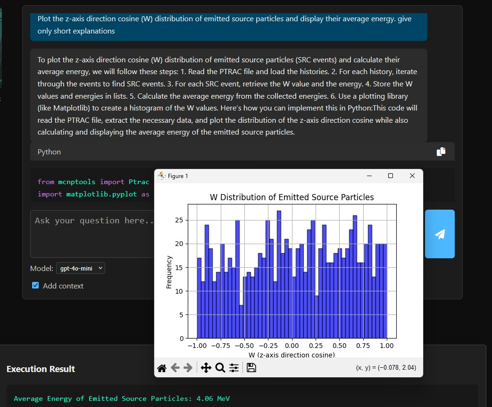

# Summary

DECIMA (**Data Extraction & Contextual Inference for MCNP Analysis**) is an open-source framework
for the analysis of Monte Carlo N-Particle (MCNP) outputs. It integrates **MCNPTools** for access to
binary and ASCII `PTRAC` files, a **Neo4j knowledge graph** for contextual reasoning, and **Large Language Models (LLMs)**
to enable natural language querying in English or French.  
DECIMA automatically translates user queries into executable Python code, runs them securely in a sandbox, and returns
structured results with explanations. A modular architecture ensures transparency, extensibility, and safe execution.  
The project is distributed under the **Apache License 2.0** (OSI-approved open source).

# Statement of need

MCNP is a widely used Monte Carlo transport code in nuclear engineering and physics. Its outputs, such as PTRAC (particle track histories) and MCTAL (tallies), contain rich information on particle transport and interactions. However, parsing and analyzing these files requires significant programming expertise and domain-specific knowledge, which can limit accessibility for non-specialists and slow down research workflows.

Over the years, several tools have been developed to facilitate MCNP output analysis. MCNPTools [@mcnptools2022] provides a reference C++/Python library for parsing MCTAL and PTRAC files, while Easy-PTRAC [@easyptrac2018] offers a graphical interface for filtering histories. Community-driven projects such as PyNE [@pyne2019], SANDY [@sandy2021], F4Enix [@f4enix2021], mc-tools [@mctools2020], and MCNPy [@mcnpy2022] extend these capabilities by focusing on specific formats or workflows. While these solutions are valuable, they remain fragmented. DECIMA differs by unifying parsing, reasoning, and execution in a single coherent framework, accessible through natural language queries.

DECIMA addresses these challenges by providing an integrated assistant that bridges natural language interaction, knowledge graph reasoning, and automated code execution. Instead of manually combining tools and scripts, users can query DECIMA in plain English or French. The system interprets the query, enriches it with structured knowledge, generates validated Python code, and executes it securely. In this way, DECIMA lowers the entry barrier for students, engineers, and researchers, enabling reproducible, auditable, and accessible analysis of MCNP outputs.

# Software description

DECIMA follows a modular and agent-based design, where each component contributes a well-defined role in the overall workflow:

QUIET (QUery Interpreter for Entity Targeting): detects the query language, extracts keywords, and identifies relevant entities (events, particles, data fields). This preprocessing step structures the request for downstream processing.

EMMA (Engine for Metadata Mapping & Analysis): connects to a Neo4j-based Knowledge Graph built from MCNPTools triplets, retrieving semantic context on classes, methods, dictionaries, and enumerations. This ensures that the system has a precise understanding of MCNP data structures.

OTACON (Operator Terminal for Assisted Communication & Output Navigation): acts as the reasoning engine. Using a Large Language Model (LLM), it combines the enriched EMMA context with static mcnptools knowledge to generate both a natural language explanation and executable Python code.

EVA (Execution and Validation Agent): runs the generated Python code inside a secure sandbox, replacing placeholders with the actual PTRAC file path. It captures outputs, plots, and errors, ensuring safe and reproducible execution.

CAMPBELL (Coordination & Assignment Manager for Process Balancing & Execution Logistics Layer): coordinates the sequential interaction between QUIET, EMMA, OTACON, and EVA. Built with LangGraph, it manages state transitions and ensures that results flow smoothly back to the user interface.

An additional functionality, **add context**, allows benchmarking LLM outputs with and without DECIMA’s contextual enrichment.  
In this mode, the same query can be answered twice: once by the raw LLM (without access to the Knowledge Graph), and once by the full DECIMA pipeline including EMMA (Knowledge Graph).  
This comparison highlights a critical finding: without context injection, current LLMs consistently fail to produce directly executable code using the `mcnptools` library.  
DECIMA’s integration of structured knowledge is therefore essential for achieving reliable and reproducible analyses.

Together, these modules create a continuous workflow:

A user query is first interpreted by QUIET, then enriched with semantic knowledge via EMMA. OTACON combines these elements to generate explanations and executable code, which EVA runs in a secure sandbox. Finally, CAMPBELL orchestrates the process and delivers the results to the web interface.

This architecture ensures both transparency and extensibility: each module can be improved or replaced independently, while the overall workflow remains consistent and user-friendly. Deployment is simplified via Docker, and a demo mode is available for reviewers to explore DECIMA without API keys.


# Example usage

To demonstrate DECIMA’s capabilities, we consider a simple but representative MCNP problem.  
The geometry consists of three concentric spherical shells:

- **Cell 501**: Highly Enriched Uranium (HEU), radius ≤ 5 cm (surface 401)  
- **Cell 502**: Water moderator, 5–6 cm (surfaces 401–402)  
- **Cell 503**: Air, 6–7 cm (surfaces 402–403)  
- **Cell 999**: Void (outside surface 403)  

A neutron source is located at the center (0,0,0) inside the HEU fuel (cell 501),  
with an energy distribution corresponding to Cf-252 spontaneous fission and an anisotropic angular distribution.  
A PTRAC output is produced for 10,000 particle histories.

---

### Step 1: Installing and launching DECIMA
DECIMA (OTACON agent) returns an explanation of the analysis process together with executable Python code.  
It should be noted that the exact code generated may vary across runs, since it is produced by a Large Language Model (LLM).  
The output can also depend on the selected backend model (e.g., GPT-4o vs GPT-4o-mini), but in all cases DECIMA ensures that the code is syntactically valid and executable within the sandbox.

After installation via Docker (please look at the README.md for complete installation and usage instructions):


```bash
git clone https://github.com/quentinducasse/decima.git
cd decima
docker compose build app
docker compose up -d
docker compose exec app python kg/loader/neo4j_loader.py
```

The user opens the web interface at [http://localhost:5050](http://localhost:5050) and uploads the PTRAC file.  


---

### Step 2: Querying in natural language
The following query is entered into DECIMA:

> *“Plot the z-axis direction cosine (W) distribution of emitted source particles and display their average energy.”*

---

### Step 3: LLM response and generated code
DECIMA (OTACON agent) returns an explanation of the analysis process together with executable Python code:

```python
from mcnptools import Ptrac
import numpy as np
import matplotlib.pyplot as plt

ptrac_path = '<PTRAC_PATH_PLACEHOLDER>'
p = Ptrac(ptrac_path, Ptrac.BIN_PTRAC)

w_values, energies = [], []

hists = p.ReadHistories(10000)
while hists:
    for h in hists:
        for e in range(h.GetNumEvents()):
            event = h.GetEvent(e)
            if event.Type() == Ptrac.SRC:
                if event.Has(Ptrac.W):
                    w_values.append(event.Get(Ptrac.W))
                if event.Has(Ptrac.ENERGY):
                    energies.append(event.Get(Ptrac.ENERGY))
    hists = p.ReadHistories(10000)

average_energy = np.mean(energies) if energies else 0

plt.hist(w_values, bins=50, alpha=0.7, color='blue', edgecolor='black')
plt.title('W (z-axis direction cosine) Distribution of Emitted Source Particles')
plt.xlabel('W Value')
plt.ylabel('Frequency')
plt.grid()
plt.axvline(x=np.mean(w_values), color='red', linestyle='dashed', linewidth=1, label='Mean W')
plt.legend()
plt.show()

print(f'Average Energy of Emitted Source Particles: {average_energy:.2f} MeV')
```

---

### Step 4: Results
The code executes successfully within DECIMA’s sandbox (EVA agent).  
The result includes a histogram of the z-axis direction cosines for emitted source particles,  
together with the computed average energy.



For this case, DECIMA reports:

```
Average Energy of Emitted Source Particles: 4.06 MeV
```

This example demonstrates how DECIMA allows users to query PTRAC files in natural language, automatically generating code, executing the analysis, and returning interpretable results in a reproducible manner.

# Related work

Several tools support MCNP output processing:

- **MCNPTools** (LANL) [@mcnptools2022]: reference C++/Python library for parsing MCTAL, MESHTAL, PTRAC.  
- **Easy-PTRAC** (ASNR) [@easyptrac2018]: GUI for filtering particle histories and exporting results.  
- **mc-tools** (community, GitHub) [@mctools2020]: Python converters (mctal2root, mctal2txt).  
- **F4Enix** (Fusion for Energy) [@f4enix2021]: modular Python package for MCNP input/output workflows.  
- **SANDY** [@sandy2021]: parses MCTAL tallies into pandas DataFrames.  
- **PyNE** [@pyne2019]: includes MCNP mesh tally parsers and a PtracReader.  
- **MCNPy** [@mcnpy2022]: Python API for MCNP input deck manipulation.  

DECIMA builds on these but is unique in combining **Knowledge Graph reasoning** and **LLM-based interaction**, enabling
human-like queries, automatic code generation, and safe execution.

# Acknowledgements
This work was carried out independently of institutional projects at ASNR and CEA.
We thank the MCNPTools developers at LANL, the ASNR LMDN group for providing access to Easy-PTRAC.  
This project also acknowledges Neo4j, OpenAI.

# References
